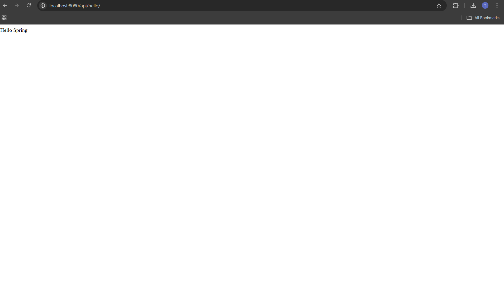

# Hello Spring
En este proyecto se muestra un proyecto de Spring Boot el cual con un controlador Rest se muestra un mensaje "Hello Spring"

# Instalacion
No muestro las capturas de la instalación y configuración ya que ya las tenía instaladas previamente.
Las herramientas que se necesitan para ejecutar esta aplicacion son:
Maven
Java Development Kit (JDK)
Git
Un IDE de su preferencia como VSCode, Netbeans, etc.
Captura de que estan instalados el Maven y JDK

Captura del funcionamiento del programa

